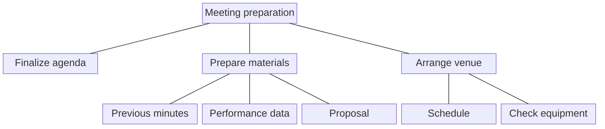

## hier-block

```mermaid
block
columns 6
space:2 N1["Meeting preparation"] space:3
space:6
N1_1["Finalize agenda"] space N1_2["Prepare materials"] space N1_3["Arrange venue"] space
space:6
space N1_2_1["Previous minutes"] N1_2_2["Performance data"] N1_2_3["Proposal"] N1_3_1["Schedule"] N1_3_2["Check equipment"]

N1 --- N1_1
N1 --- N1_2
N1 --- N1_3
N1_2 --- N1_2_1
N1_2 --- N1_2_2
N1_2 --- N1_2_3
N1_3 --- N1_3_1
N1_3 --- N1_3_2
```
