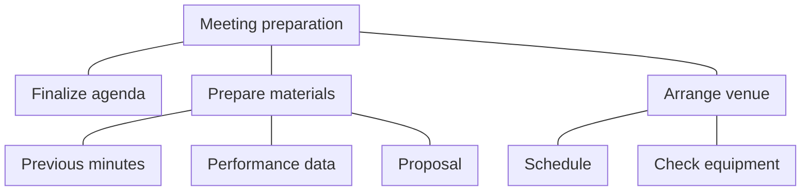

## hier-flow

```mermaid
---
config:
  flowchart:
    padding: 8
    nodeSpacing: 30
    rankSpacing: 30
    diagramPadding: 5
---
flowchart TB
N1["Meeting preparation"] --- N1_1["Finalize agenda"]
N1 --- N1_2["Prepare materials"]
N1 --- N1_3["Arrange venue"]
N1_2 --- N1_2_1["Previous minutes"]
N1_2 --- N1_2_2["Performance data"]
N1_2 --- N1_2_3["Proposal"]
N1_3 --- N1_3_1["Schedule"]
N1_3 --- N1_3_2["Check equipment"]
```
