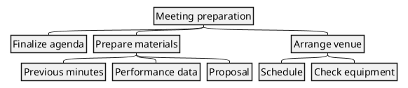

## hier-mind

```plantuml
@startmindmap
<style>
mindmapDiagram {
  node {
    RoundCorner 0
    Padding 3
    Margin 5
  }
}
</style>
top to bottom direction
* Meeting preparation
** Finalize agenda
** Prepare materials
*** Previous minutes
*** Performance data
*** Proposal
** Arrange venue
*** Schedule
*** Check equipment
@endmindmap
```
