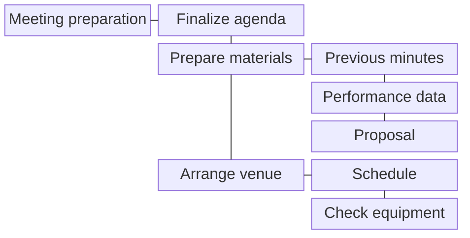

## struct-flow (--layout tight)

```mermaid
block
columns 3
N1["Meeting preparation"] N1_1["Finalize agenda"] space
space N1_2["Prepare materials"] N1_2_1["Previous minutes"]
space:2 N1_2_2["Performance data"]
space:2 N1_2_3["Proposal"]
space N1_3["Arrange venue"] N1_3_1["Schedule"]
space:2 N1_3_2["Check equipment"]

N1 --- N1_1
N1_1 --- N1_2
N1_2 --- N1_2_1
N1_2_1 --- N1_2_2
N1_2_2 --- N1_2_3
N1_2 --- N1_3
N1_3 --- N1_3_1
N1_3_1 --- N1_3_2
```
