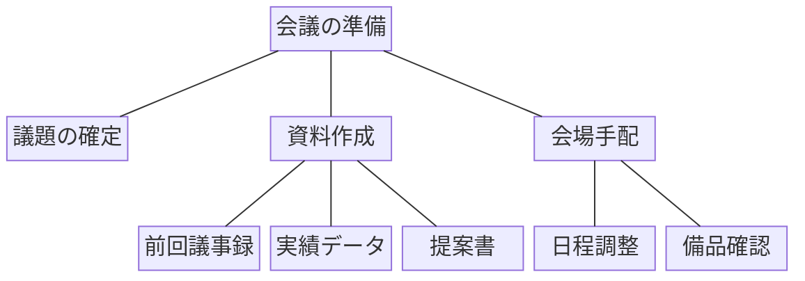

## hier-block

```mermaid
block
columns 6
space:2 N1["会議の準備"] space:3
space:6
N1_1["議題の確定"] space N1_2["資料作成"] space N1_3["会場手配"] space
space:6
space N1_2_1["前回議事録"] N1_2_2["実績データ"] N1_2_3["提案書"] N1_3_1["日程調整"] N1_3_2["備品確認"]

N1 --- N1_1
N1 --- N1_2
N1 --- N1_3
N1_2 --- N1_2_1
N1_2 --- N1_2_2
N1_2 --- N1_2_3
N1_3 --- N1_3_1
N1_3 --- N1_3_2
```
