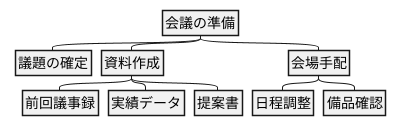

## hier-mind

```plantuml
@startmindmap
<style>
mindmapDiagram {
  node {
    RoundCorner 0
    Padding 3
    Margin 5
  }
}
</style>
top to bottom direction
* 会議の準備
** 議題の確定
** 資料作成
*** 前回議事録
*** 実績データ
*** 提案書
** 会場手配
*** 日程調整
*** 備品確認
@endmindmap
```
