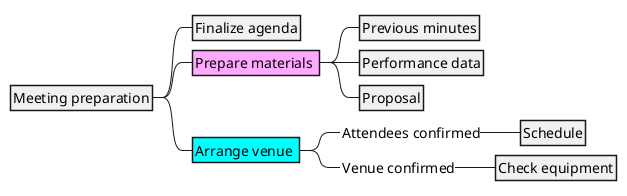

## hier-mindlabel (--direction LR)

```plantuml
@startmindmap
<style>
mindmapDiagram {
  node {
    RoundCorner 0
    Padding 3
    Margin 5
  }
  .N1_2Node {
    BackgroundColor #FAF
  }
  .N1_3Node {
    BackgroundColor #0FF
  }
}
</style>
left to right direction
* Meeting preparation
** Finalize agenda
** Prepare materials <<N1_2Node>>
*** Previous minutes
*** Performance data
*** Proposal
** Arrange venue <<N1_3Node>>
***_ Attendees confirmed
**** Schedule
***_ Venue confirmed
**** Check equipment
@endmindmap
```
