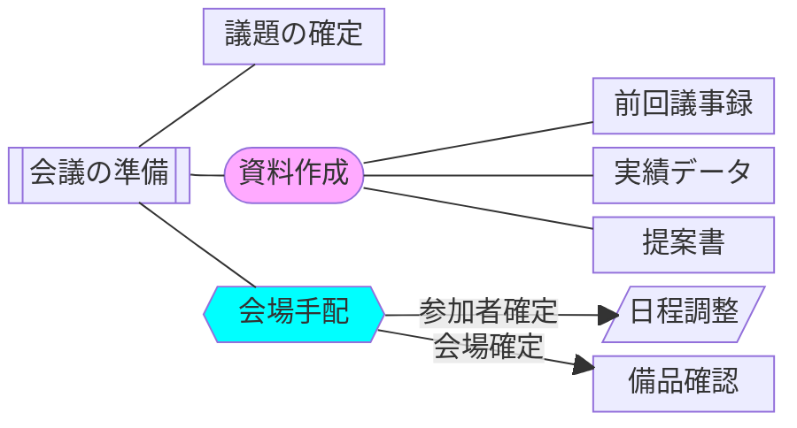

## hier-block (--direction LR --layout tight)

```mermaid
block
columns 4
space N1_1["議題の確定"] space:2
space:3 N1_2_1["前回議事録"]
N1[["会議の準備"]] N1_2(["資料作成"]) space N1_2_2["実績データ"]
space:3 N1_2_3["提案書"]
space N1_3{{"会場手配"}} space N1_3_1[/"日程調整"/]
space:3 N1_3_2["備品確認"]

N1 --- N1_1
N1 --- N1_2
N1 --- N1_3
N1_2 --- N1_2_1
N1_2 --- N1_2_2
N1_2 --- N1_2_3
N1_3 -- "参加者確定" ---> N1_3_1
N1_3 -- "会場確定" ---> N1_3_2

style N1_2 fill:#FAF
style N1_3 fill:#0FF
```
