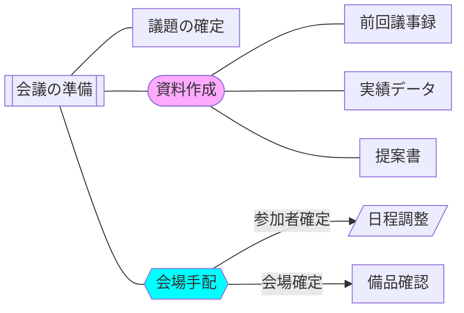

## hier-flow (--direction LR)

```mermaid
---
config:
  flowchart:
    padding: 8
    nodeSpacing: 30
    rankSpacing: 30
    diagramPadding: 5
---
flowchart LR
N1[["会議の準備"]] --- N1_1["議題の確定"]
N1 --- N1_2(["資料作成"])
N1 --- N1_3{{"会場手配"}}
N1_2 --- N1_2_1["前回議事録"]
N1_2 --- N1_2_2["実績データ"]
N1_2 --- N1_2_3["提案書"]
N1_3 --> |"参加者確定"|N1_3_1[/"日程調整"/]
N1_3 --> |"会場確定"|N1_3_2["備品確認"]

style N1_2 fill:#FAF
style N1_3 fill:#0FF
```
