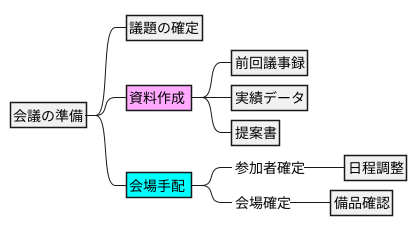

## hier-mindlabel (--direction LR)

```plantuml
@startmindmap
<style>
mindmapDiagram {
  node {
    RoundCorner 0
    Padding 3
    Margin 5
  }
  .N1_2Node {
    BackgroundColor #FAF
  }
  .N1_3Node {
    BackgroundColor #0FF
  }
}
</style>
left to right direction
* 会議の準備
** 議題の確定
** 資料作成 <<N1_2Node>>
*** 前回議事録
*** 実績データ
*** 提案書
** 会場手配 <<N1_3Node>>
***_ 参加者確定
**** 日程調整
***_ 会場確定
**** 備品確認
@endmindmap
```
