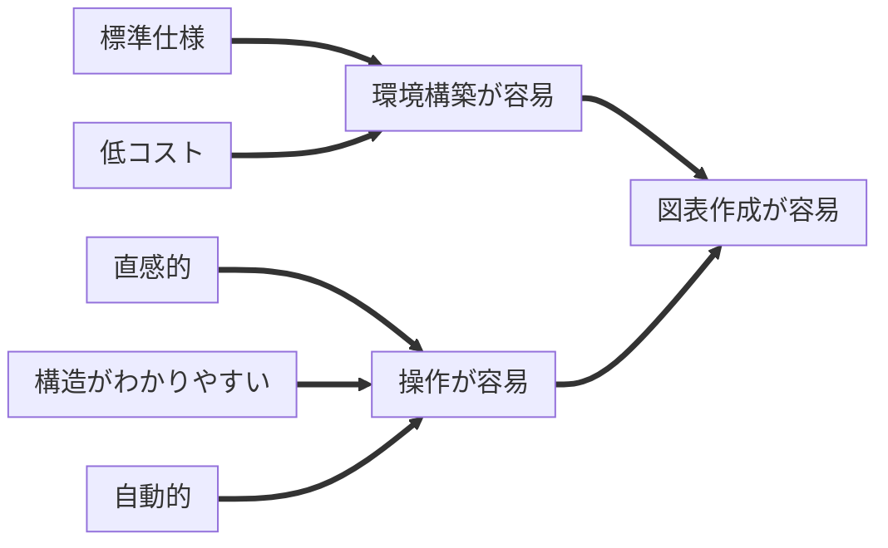

## hier-flow (--direction RL --line thickArrow --arrowDirection reverse)

```mermaid
---
config:
  flowchart:
    padding: 8
    nodeSpacing: 30
    rankSpacing: 30
    diagramPadding: 5
---
flowchart LR
N1_1["環境構築が容易"] ==> N1["図表作成が容易"]
N1_2["操作が容易"] ==> N1
N1_1_1["標準仕様"] ==> N1_1
N1_1_2["低コスト"] ==> N1_1
N1_2_1["直感的"] ==> N1_2
N1_2_2["構造がわかりやすい"] ==> N1_2
N1_2_3["自動的"] ==> N1_2
```
