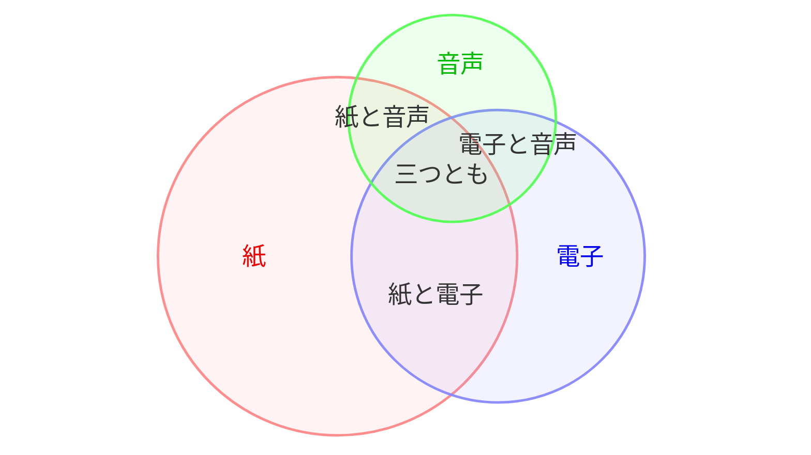

## venn

```mermaid
venn-beta
  set N1["紙"]:30
  set N2["電子"]:20
  union N1,N2["紙と電子"]:10
  set N3["音声"]
  union N1,N3["紙と音声"]:5
  union N2,N3["電子と音声"]:5
  union N1,N2,N3["三つとも"]

  style N1 fill:#f88
  style N2 fill:#88f
  style N3 fill:#5f5
```
