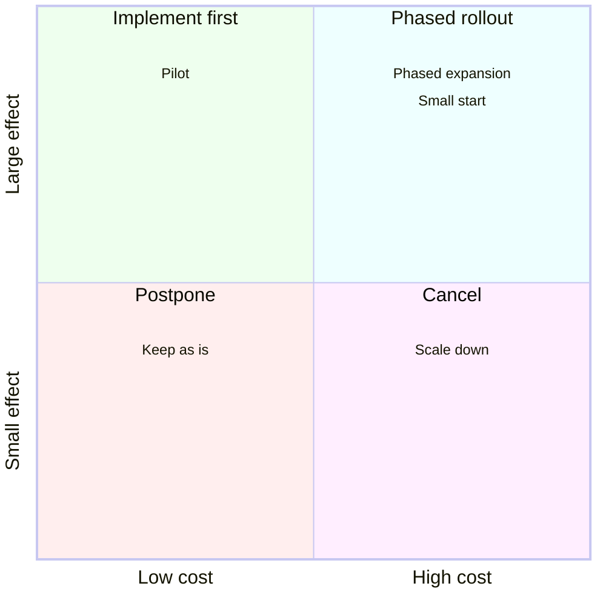

## quadrant

```mermaid
---
config:
  themeVariables:
    quadrant1Fill: "#eff"
    quadrant2Fill: "#efe"
    quadrant3Fill: "#fee"
    quadrant4Fill: "#fef"
---
quadrantChart
  x-axis "Low cost" --> "High cost"
  y-axis "Small effect" --> "Large effect"
  quadrant-1 "Phased rollout"
  quadrant-2 "Implement first"
  quadrant-3 "Postpone"
  quadrant-4 "Cancel"
  "Keep as is": [0.25, 0.4] radius:0
  "Pilot": [0.25, 0.9] radius:0
  "Scale down": [0.75, 0.4] radius:0
  "Phased expansion": [0.75, 0.9] radius:0
  "Small start": [0.75, 0.85] radius:0
```
