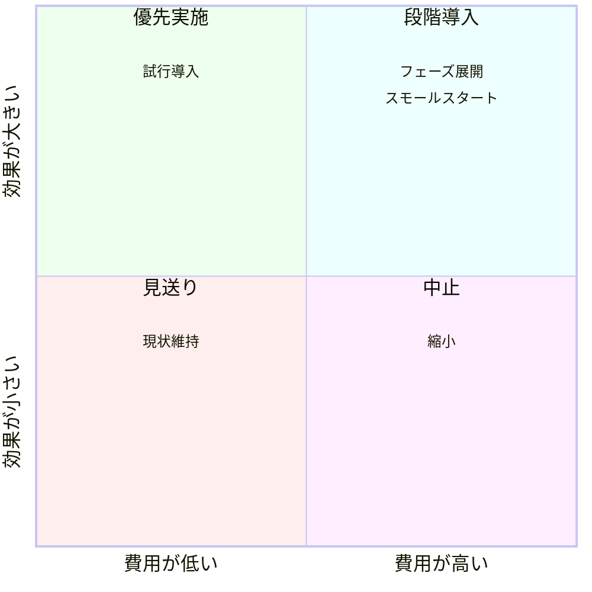

## quadrant

```mermaid
---
config:
  themeVariables:
    quadrant1Fill: "#eff"
    quadrant2Fill: "#efe"
    quadrant3Fill: "#fee"
    quadrant4Fill: "#fef"
---
quadrantChart
  x-axis "費用が低い" --> "費用が高い"
  y-axis "効果が小さい" --> "効果が大きい"
  quadrant-1 "段階導入"
  quadrant-2 "優先実施"
  quadrant-3 "見送り"
  quadrant-4 "中止"
  "現状維持": [0.25, 0.4] radius:0
  "試行導入": [0.25, 0.9] radius:0
  "縮小": [0.75, 0.4] radius:0
  "フェーズ展開": [0.75, 0.9] radius:0
  "スモールスタート": [0.75, 0.85] radius:0
```
