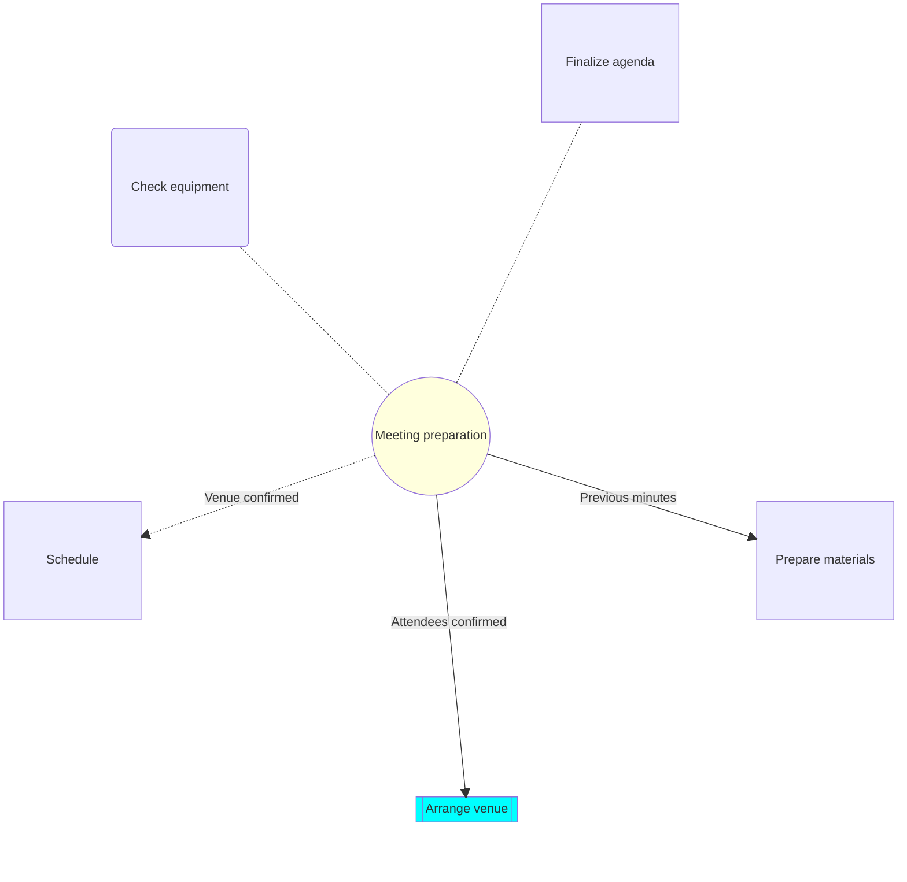

## star (--line dotted --degree 30)

```mermaid
block
columns 25
space:15 N1_1["Finalize agenda"]:4 space:6
space:3 N1_5("Check equipment"):4 space:18
space:25
space:10 N1(("Meeting preparation")):4 space:11
N1_4["Schedule"]:4 space:17 N1_2["Prepare materials"]:4
space:25
space:11 N1_3[["Arrange venue"]]:4 space:10

N1 -.- N1_1
N1 -- "Previous minutes" ---> N1_2
N1 -- "Attendees confirmed" ---> N1_3
N1 -- "Venue confirmed" -.-> N1_4
N1 -.- N1_5

style N1 fill:#ffd
style N1_3 fill:#0FF
```
